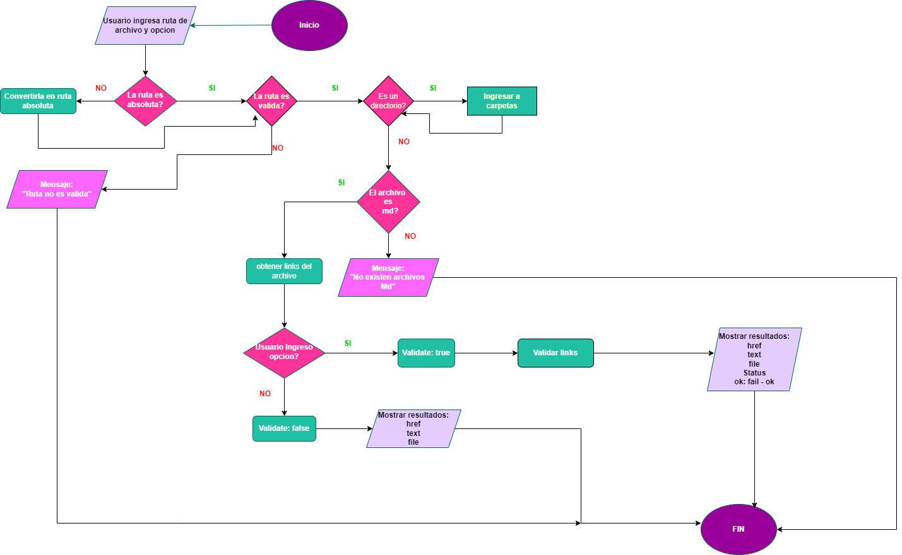

# Markdown Links

MDLINKS es una librería que lee y analiza archivos en formato [Markdown](https://es.wikipedia.org/wiki/Markdown), y verifica si los Links contenidos en estos archivos están rotos o ya no son válidos de manera que no se perjudique el valor de la información que se busca  compartir. La libreria MdLinks, sirve de apoyo para esta tarea presentando estadisticas de los links contenidos.

***
## 1. Diagrama de flujo



## 2. Instalacion
Para su instalación se debe ejecutar 

`npm install stavil-md-links`

## 3. Uso
Para acceder a la librería se debe importar de la siguiente manera:

`const mdLinks = require ("stavil-md-links");`


## 4. Modo de uso

El modulo ofrece la siguiente interfaz

#### `md-links <path> <options>`

### Argumentos

#### * `path`: Ruta **absoluta** o **relativa** al **archivo** o **directorio**.

#### * `options`: Las opciones que se pueden ingresar son:
  - `--validate`: Se mostrarán los resultados de los links encontrados en el siguiente formato:

`path | url | estado | texto`

Donde: 

`path`: Ruta ingresada

`url`: Link encontrado

`estado`: ok -> si el link es válido    
          fail-> si el link esta roto o es inválido
          
`texto`: Texto que hay dentro del link (truncado a 50 caracteres).       

Ejemplo:

```sh
$ md-links ./some/example.md --validate
./some/example.md | http://algo.com/2/3/ | ok 200 | Link a algo
./some/example.md | https://otra-cosa.net/algun-doc.html | fail 404 | algún doc
./some/example.md | http://google.com/ | ok 301 | Google
```
  - `--stats`: Se mostrarán las estadisticas de los links encontrados en el siguiente formato:
```sh
Total: 3
Unique: 3
```
Donde: 
`Total`: Cantidad de links encontrados
`Unique`: Cantidad de links únicos

Ejemplo:

  ```sh
$ md-links ./some/example.md --stats
Total: 3
Unique: 3
```
  - `--validate--stats`: Se mostrarán las estadisticas de los links encontrados y la cantidad de link rotos en el siguiente formato:

```sh
Total: 3
Unique: 3
Broken: 1
```
Donde: 

`Total`: Cantidad de links encontrados

`Unique`: Cantidad de links únicos

`Broken`: Cantidad de links rotos o inválidos

Ejemplo:

  ```sh
$ md-links ./some/example.md --validate--stats
Total: 3
Unique: 3
Broken: 1
```
En caso de no ingresarse alguna opción, el comportamiento por defecto no valida si las URLs son válidas, solo se identifica el archivo markdown (a partir de la ruta que recibe como argumento), analiza el archivo Markdown e imprime los links que vaya encontrando, junto con la ruta del archivo donde aparece y el texto que hay dentro del link, en el siguiente formato:

`path | url | texto`

Donde: 

`path`: Ruta ingresada

`url`: Link encontrado

`texto`: Texto que hay dentro del link (truncado a 50 caracteres).       

Ejemplo:

```sh
$ md-links ./some/example.md
./some/example.md | http://algo.com/2/3/ | Link a algo
./some/example.md | https://otra-cosa.net/algun-doc.html | algún doc
./some/example.md | http://google.com/ | Google
```
